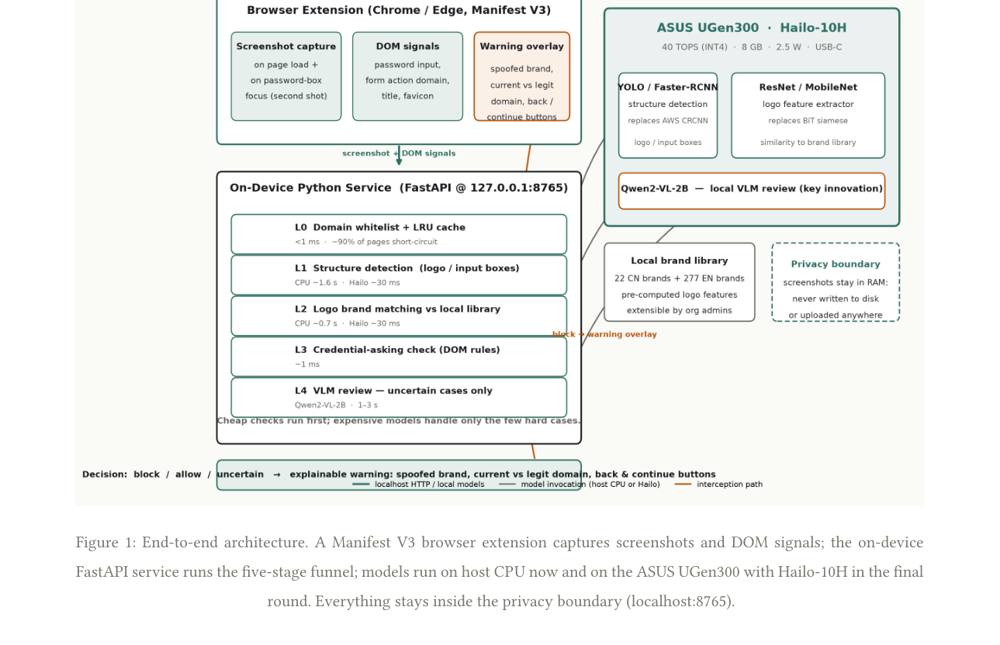

# PhishLens Edge — On-Device Visual Phishing Defense

**PhishLens Edge** is a local-first phishing detection system for the workplace.
A browser extension captures page screenshots and DOM signals; an on-device
Python service runs a five-stage funnel of cheap-to-expensive checks; the
decision is `block` / `allow` / `uncertain` with an explainable warning overlay.
**Screenshots never leave the machine.**

> Visual phishing detection without cloud APIs. Built for the
> [ASUS UGen AI League](https://contest.bhuntr.com/tw/39jg9vimiynrhlksze/home/),
> running today on host CPU and targeting the ASUS UGen300 (Hailo-10H) edge
> accelerator: 40 TOPS (INT4), 8 GB LPDDR5, ~2.5 W, USB-C.

---

## How it decides

A page is **blocked** only when **all three** conditions hold (the shared
principle of Phishpedia / PhishIntention / PhishVLM):

1. the page **impersonates a known brand** (logo visually matches the local brand library), **and**
2. the **current domain is not** one of that brand's official domains, **and**
3. the page **asks for credentials** (password input / login form).

Any missing condition → `allow` or `uncertain` (explainable, no false-block pressure).

## Architecture



| Level | Check | Cost (host CPU, hot) |
|---|---|---|
| **L0** | domain whitelist + LRU result cache | < 1 ms · short-circuits ~most benign pages |
| **L1** | logo / structure detection (Faster R-CNN, AWL) | ~1.6 s |
| **L2** | brand matching vs. local library (OCR-aided Siamese + MobileNet for CN brands) | ~0.7 s |
| **L3** | credential-asking check from DOM signals | ~1 ms |
| **L4** | VLM review — uncertain cases only (local Qwen2-VL-2B hook; rule-based fallback ships) | 1–3 s |

Cheap checks run first; expensive models only see the few hard cases.

### Repository layout

```
browser-extension/   Manifest V3 extension: screenshots, DOM signals, warning overlay
server/              FastAPI service @127.0.0.1:8765, /analyze endpoint, L0–L4 funnel
brand_library/       30 protected brands (22 CN + 8 EN) + feature extractor
tools/               testset capture, fake-page builder, offline evaluation
docs/                per-task reproduction & evaluation reports
third_party/         (not published) Phishpedia / PhishIntention / PhishVLM checkouts
testset/             (not published) 50+50+3 evaluation screenshots
```

## Quick start

Prerequisites: Python 3.11 (the vision stack wheels were built for cp311),
Google Chrome or Edge.

```bash
# 1. Virtualenv + deps (vision stack: torch 2.1.0+cpu, torchvision, detectron2 0.6)
python -m venv .venv
.venv/Scripts/pip install -r server/requirements.txt

# 2. Third-party model weights (Phishpedia/PhishIntention checkouts & weights,
#    detectron2/torch CPU wheels). The community wheels used in this project:
#    torch-2.1.0+cpu / torchvision-0.16.0+cpu (CPU builds) and
#    detectron2-0.6+18f6958pt2.1.0cpu (Windows amd64 wheel by MiroPsota).
#    Clone lindsey98/Phishpedia + lindsey98/PhishIntention next to this repo and
#    place their weights under detection_models/ as described in docs/T2/T3.

# 3. Start the local service
.venv/Scripts/python server/app.py        # FastAPI @ http://127.0.0.1:8765

# 4. Load the extension
#    chrome://extensions → Developer mode → Load unpacked → browser-extension/

# 5. (Optional) rebuild the brand library
.venv/Scripts/python brand_library/build_brand_library.py
.venv/Scripts/python brand_library/extract_features.py
```

Try it end-to-end: start the service, open a self-built fake page
(`python tools/make_fake_pages.py` writes a local `fake_alipay` login page),
focus the password box — the extension takes a second screenshot, the funnel
returns `block`, and the warning overlay explains the spoofed brand, current
vs. official domain, with **Back** and **I trust this page, continue** buttons.

## Preliminary results

Evaluated on **50 OpenPhish phishing screenshots + 50 benign login pages + 3
self-built Chinese fake pages** (host CPU, Windows, no GPU).

| Metric | Result |
|---|---|
| Phishing recall (brand confirmed, blocked) | 13/50 = **26%** |
| Benign false-positive rate | **0/50 = 0%** |
| Self-built fake-page interception | **3/3 = 100%** |
| Brand recognition accuracy (when a brand fired) | **13/13 = 100%** |
| End-to-end latency (hot, per sample) | **2.144 s** |
| Cold start (models + 3069-logo feature cache) | ~789 s, excluded from stats |

Funnel split: 95/103 samples take the visual path; 8 benign samples
short-circuit at L0. Every detected phishing page carried the genuine brand
logo from the reference library.

**Honest limitation:** the L1 logo detector only fires on clean logo regions;
37/50 OpenPhish crawls have tiny, occluded, or degraded logos, so the visual
funnel misses them (the 26% is a baseline, not the final number). A local
Qwen2-VL-2B L4 review and an improved detector are the final-round levers —
see `docs/T9-evaluation.md` for the full breakdown.

## Privacy & ethics

- Screenshots are processed **in RAM only** — never written to disk, never uploaded.
- The event log records URL, brand and decision only (SIEM-ready, JSON Lines).
- Phishing URLs are collected from OpenPhish and visited only in an isolated
  sandboxed browser; self-built fake pages are clearly marked and served
  locally for testing only; no directly usable phishing page source is published.
- Brand logos/trademarks belong to their respective owners and are used here
  solely for research and evaluation.

## License & third-party notices

- This project: **Apache-2.0** (see [LICENSE](LICENSE)).
- Third-party components: see [THIRD_PARTY_LICENSES](THIRD_PARTY_LICENSES.md).

## Docs

- `docs/T2-phishpedia-repro.md` — Phishpedia reproduction on CPU
- `docs/T3-phishintention-repro.md` — PhishIntention reproduction (brand-matching logic)
- `docs/T4-phishvlm-repro.md` — PhishVLM review pipeline & why we replace its cloud API with a local VLM
- `docs/T5T6-extension-and-service.md` — extension + FastAPI service
- `docs/T7-brand-library.md` — brand library build
- `docs/T8-testset.md` — testset collection
- `docs/T9-evaluation.md` — full evaluation report